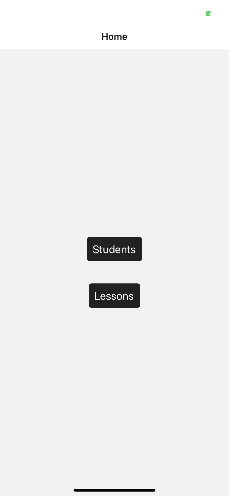

# Les composants

React Native utilise ses propres composants de rendu, pour cibler les applications mobiles. Voyons un exemple :

```js
<View>
    <TextInput placeholder='City'/>
    <Button title='Search' onPress={() => {}}/>
</View>
```

Le composant View est nécessaire pour afficher un contenu sur l'écran du téléphone. Le composant TextInput permet d'afficher un champ de recherche et le composant Button le bouton qui déclenchera l'action de recherche.

React Native gère les différents rendus en fonction de iOS ou Android et affichera le bouton de recherche spécifiquement dans le style de ces contextes. Le composant Button est donc générique, pour Android React Native utilisera un bouton **android.widget.Button** et pour iOS un bouton **UIButton**.

## Présentation des principaux composants


| React Native | Android       |  iOS           | Web                     | 
|--------------|:-------------:|:---------------:|:----------------------- |
| \<View\>     | \<ViewGroup\> | \<UIView\>     | \<div\>                 |
| \<Text\>     | \<TextView\>  | \<UITextView\> | \<p\>                   |
| \<Image\>    | \<ImageView\> | \<UIImageView\>| \                 |
| \<ScrollView\>| \<ScrollView\> | \<UIScrollView\>| \<div\>              |
| \<TextInput\>| \<EditText\> | \<UITextField\>| \<input type="text"\>    |


Vous trouvrez dans la documentation officielle la liste des composants principaux de React Native : [compoments](https://reactnative.dev/docs/components-and-apis#ios-components-and-apis)

## Composants customisés

Comme vous travaillez avec la même librairie React, vous continuerez à utiliser tout ce que vous connaissez en React dans React Native.

Vous pouvez tout à fait créer des composants réutilisables, modulables...

```js
import React from 'react';
import { Text, TextInput, View } from 'react-native';

const Tea = ({ genre }) => {
  return (
    <View>
      <Text>Tea time</Text>
    </View>
  );
}

export default Teapot = () => {
  return (
    <View>
      <Text>Tea time</Text>
      <Tea genre="mint" />
      <Tea genre="licorice" />
      <Tea genre="licorice" />
    </View>
  );
}
```

## Composant View

Le composant View est un conteneur qui permet d'afficher les autres composants à l'écran, il permettra : de styliser les éléments de rendu avec flexbox et les styles CSS, d'inclure des composants tactiles et de gérer les actions d'accessibilitées liées à l'interface utilisateur.

\newpage

```js
import React from 'react';
import { Text, View } from 'react-native';

const ViewExample = () => {
  return (
    <View
      style={{
        flexDirection: "row",
        height: 100,
        padding: 5
      }}
    >
      <View style={{ backgroundColor: "blue", flex: 0.3 }} />
      <View style={{ backgroundColor: "red", flex: 0.5 }} />
      <Text>Hello World!</Text>
    </View>
  );
};

export default ViewExample ;
```

Vous pouvez séparer les styles de vos composants en utilisant la classe **StyleSheet** de React Native :

```js
import React from 'react';
import { StyleSheet, Text, View } from 'react-native';
const styles = StyleSheet.create({
  container: {
    flexDirection: "row",
    height: 100,
    padding: 5
  },
  blue: {
    backgroundColor: "blue", flex: 0.3
  },
  red: {
    backgroundColor: "red", flex: 0.5
  },

});

const ViewExample = () => {
    return (
      <View style={styles.container}>
        <Text style={[styles.blue]} />
        <Text style={[styles.red]} />
        <Text>Hello World!</Text>
      </View>
    );
}

export default ViewExample;
```

Vous pouvez également créer un fichier pour vos propres styles puis, vous les importez dans vos composants :

```js
import React from 'react';
import { Text, View } from 'react-native';
import myStyle from './myStyle';

const ViewExample = () => {
    return (
      <View style={myStyle.container}>
        <Text style={[myStyle.blue]} />
        <Text style={[myStyle.red]} />
        <Text>Hello World!</Text>
      </View>
    );
}

export default ViewExample;
```

## Flexbox rappels

### Flex direction

Considérons la mise en page suivante :

```js
<View style={{flex: 1, flexDirection: 'row'}}>
    <View style={{width: 50, height: 50, backgroundColor: 'powderblue'}} />
    <View style={{width: 50, height: 50, backgroundColor: 'skyblue'}} />
    <View style={{width: 50, height: 50, backgroundColor: 'steelblue'}} />
</View>
```

flexDirection : **'row'** :

```text
------------
|XXX       |
|          |
|          |
|          |
|          |
|          |
|          |
------------
```

flexDirection : **'row-reverse'** :

```text
------------
|       XXX|
|          |
|          |
|          |
|          |
|          |
|          |
------------
```

flexDirection : **'column'** :

```text
------------
|X         |
|X         |
|X         |
|          |
|          |
|          |
|          |
------------
```

flexDirection : **'column-reverse'** :

```text
------------
|          |
|          |
|          |
|          |
|X         |
|X         |
|X         |
------------
```

### Justify Content

```js
<View style={{
  flex: 1,
  flexDirection: 'column',
  justifyContent: 'center',
  alignItems: 'space-between',
}}>
  <View style={{height: 50, backgroundColor: 'powderblue'}} />
  <View style={{height: 50, backgroundColor: 'skyblue'}} />
  <View style={{height: 50, backgroundColor: 'steelblue'}} />
</View>
```

justifyContent : '**space-between**'

```text
------------
|X         |
|          |
|          |
|X         |
|          |
|          |
|X         |
------------
```

justifyContent : '**space-around**'

```text
------------
|          |
|X         |
|          |
|X         |
|          |
|X         |
|          |
------------
```

justifyContent : '**flex-start**'

```text
------------
|X         |
|X         |
|X         |
|          |
|          |
|          |
|          |
------------
```

justifyContent : '**center**'

```text
------------
|          |
|          |
|X         |
|X         |
|X         |
|          |
|          |
------------
```

justifyContent : '**flex-end**'

```text
------------
|          |
|          |
|          |
|          |
|X         |
|X         |
|X         |
------------
```

### Align Items


```js
<View style={{
    flex: 1,
    flexDirection: 'column',
    justifyContent: 'center',
    alignItems: 'stretch',
  }}>
    <View style={{height: 50,  backgroundColor: 'powderblue'}} />
    <View style={{height: 50, backgroundColor: 'skyblue'}} />
    <View style={{height: 50, backgroundColor: 'steelblue'}} />
  </View>
```

alignItems: '**stretch**'

```text
------------
|          |
|          |
|XXXXXXXXXX|
|XXXXXXXXXX|
|XXXXXXXXXX|
|          |
|          |
------------
```

alignItems: '**flex-start**'

Attention, dans ce cas il faut donner une dimension aux carrés :

```js
<View style={{
  flex: 1,
  flexDirection: 'column',
  alignItems: 'flex-start',
}}>
  <View style={{height: 50, width: 50, backgroundColor: 'powderblue'}} />
  <View style={{height: 50, width: 50, backgroundColor: 'skyblue'}} />
  <View style={{height: 50, width: 50, backgroundColor: 'steelblue'}} />
</View>
```

```text
------------
|X         |
|X         |
|X         |
|          |
|          |
|          |
|          |
------------
```

alignItems: '**center**'

```text
------------
|     X    |
|     X    |
|     X    |
|          |
|          |
|          |
|          |
------------
```

Si vous ajoutez la propriété justifyContent alors l'alignement se fera également sur l'axe verticale :

```js
<View style={{
  flex: 1,
  flexDirection: 'column',
  justifyContent: 'center',
  alignItems: 'center'
}}>
  <View style={{height: 50, width: 50, backgroundColor: 'powderblue'}} />
  <View style={{height: 50, width: 50, backgroundColor: 'skyblue'}} />
  <View style={{height: 50, width: 50, backgroundColor: 'steelblue'}} />
</View>
```

```text
------------
|          |
|          |
|     X    |
|     X    |
|     X    |
|          |
|          |
------------
```

 alignItems: '**flex-end**'

```text
------------
|         X|
|         X|
|         X|
|          |
|          |
|          |
|          |
------------
```

Pour plus de détails sur les flexbox vous pouvez vous reporter à la documentation sur le site de React Native : [flexbox](https://reactnative.dev/docs/flexbox)

## Composant TextInput

Ce composant fait partie des composants principaux de React Native. Il vous permet de mettre en place un champ de saisi.

### 01 Exercice TextInput

Utilisez pour l'instant snack.expo pour faire l'exercice [sandbox](https://snack.expo.io/)

1. Créez un champ centré permettant de saisir une chaine de caractères. Affichez le nombre de caractères saisis par mot, sans compter les espaces.

2. Ajoutez un bouton qui inverse la phrase saisie et un bouton qui efface la saisie.


Voir le Wireframe ci-dessous pour vous aider :

```text
[ Hello World !]

5 5 1

[reverse]
[clear]

```

### 02 Exercice votes 

Développez l'application votes suivante, vous pouvez utiliser snack.expo, le mieux étant d'utiliser expo init maintenant. Il y a 4 couples de deux candidats, à chaque fois l'utilisateur doit voter pour un candidat. Une fois tous les votes effectués on affichera les résultats sur une "page" (pas de pagination à mettre en place pour l'instant) différente. Un bouton reset est prévu pour réinitialiser les votes.

Faites deux composants : App et Favorite. 

Vous devez utiliser l'approche fonctionnelle de React. Pour la gestion de la logique algorithmique et pour la mise à jour des données vous pouvez utiliser :

- Soit un useReducer avec le context API de React

- Soit un Redux

Voyez les wireframes ci-dessous.

Pensez à utiliser la documentation officiel pour réaliser cet exercice. Faites une esquisse de l'application sur papier avant de commencer le développement.

Remarques sur le composant Button, ce dernier pose des problèmes de rendu (style CSS) sur iOS, on peut lui préférer une autre approche avec le composant suivant **TouchableOpacity**.

\newpage

```js
<View style={styles.countContainer}>
<TouchableOpacity
  style={styles.button}
  onPress={() => Alert('on Press')}
>
  <Text>Press Here</Text>
</TouchableOpacity>
</View>

const styles = StyleSheet.create({

  button: {
    alignItems: "center",
    backgroundColor: "#DDDDDD",
    padding: 10
  },
  countContainer: {
    alignItems: "center",
    padding: 10
  }
});
```

Vous utiliserez également le composant **FlatList** il permet de rendre une liste d'items, utilisez la documentation pour le mettre en place dans l'exercice :

[Flatlist](https://reactnative.dev/docs/flatlist)

- Liste des candidats :

```js
 candidates: [
    { choice_1: "Alan", choice_2: "Juliette" },
    { choice_1: "Phi", choice_2: "Bernard" },
    { choice_1: "Lisa", choice_2: "Elise" },
    { choice_1: "Cecilia", choice_2: "Alice" },
  ],

```

- fig 1 composant App : on vote pour un des deux candidats en cliquant sur un des deux noms sur cette page. Une fois que l'on a voté on passe aux choix suivants.

```text
-------------------
| Welcone         |
| React Native    |
|-----------------|
|   It's Alan     |
|-----------------|
|   It' Juliette  |
-------------------
```

Puis, une fois les votes terminées on affichera les résultats.

- fig 2 composant Favorite (résultats des votes)

```text
-------------------
| Welcone         |
| React Native    |
|-----------------|
|   1. Alan       |
|   2. Phi        |
|   3. Elise      |
|   4. Alice.     |
-------------------
| Reset Favorites |
-------------------
```

Le bouton Reset Favorites permettra de réinitialiser les votes. Si on clique dessus dans ce cas ré-afficher la première vue fig 1 ci-dessus.

### Partie facultative 

Si vous avez le temps. Pour cette dernière partie faites une nouvelle branche history.

3. Ajoutez un reducer history. Celui-ci mémorisera l'historique des différents votes effectués dans l'application maximun 10 essais. Vous afficherez, en utilisant l'historique, dans le composant Favorite le pourcentage des votes par candidats. Voyez l'exemple qui suit :

```text
---------------------------------
| Welcone                       |
| React Native                  |
| total essai(s) :              |
| 10.                           |
|-------------------------------|
|   1. Alan 0.2 Juliette 0.01   |
|   2. Phi  0.1 Bernard  0.2    |
|   3. Elise 0.2 Lisa   0.09    |
|   4. Alice  0.1 Cecilia  0.1  |
---------------------------------
|         Reset Favorites       |
---------------------------------
```


## Exercice Navigation School App 

Vous allez créer une application listant des étudiants avec leur nombre d'abscence(s) et les cours qu'ils suivent. Une page présentera tous les cours et une autre permettra d'administrer (ajouter) une abscence dans un premier temps. D'autres options sont à développer et détaillées dans ce qui suit. 

Nous utiliserons React Native Navigation, pensez à utiliser la documentation officiel : [react native navigation](https://reactnavigation.org/)

Suivez les consignes ci-dessous :

1. Installez un nouveau projet et choisissez **blank** à partir de la commande expo cli :

```bash
expo init school
```

2. Installez ensuite les dépendances supplémentaires dans le projet school :

Pour les modalités d'installation 

```bash
# yarn  
# yarn add @react-navigation/native

npm install @react-navigation/native

expo install react-native-gesture-handler react-native-reanimated react-native-screens react-native-safe-area-context @react-native-community/masked-view

# yarn
# yarn add @react-navigation/stack

npm install @react-navigation/stack
```

### Navigation

Voici un exemple de navigation simple, lisez les commentaires avant de construire la navigation demandée dans le projet.

```js
import React from 'react';
import { Button, View, Text } from 'react-native';
import { NavigationContainer } from '@react-navigation/native';
import { createStackNavigator } from '@react-navigation/stack';

// Construction des menus
const HomeScreen = ({ navigation })  => {
  return (
    <View style={{ flex: 1, alignItems: 'center', justifyContent: 'center' }}>
      <Text>Home Screen</Text>
      <Button
        title="Go to Details"
        onPress={() => navigation.navigate('Details')}
      />
    </View>
  );
}

const DetailsScreen = ({ navigation }) =>{
  return (
    <View style={{ flex: 1, alignItems: 'center', justifyContent: 'center' }}>
      <Text>Details Screen</Text>
      {/* 
        On navigue d'un composant à l'autre 
        à l'aide de la méthode navigate de navigation 
      */}
      <Button
        title="Go back..."
        onPress={() => navigation.navigate('Home')}
      />
    </View>
  );
}

// On utilise la classe createStackNavigator de React navigation
const Stack = createStackNavigator();

// Définition de la navigation pour votre application 
// Notez que initialRouteName définit la page par défaut 
// quand l'application se charge

// Vous devez définir un wraper NavigationContainer puis 
// utilisez les composants Stack.Navigator et Stack.Screen
// pour définir les éléments de navigation
const Nav = () => {
  return (
    <NavigationContainer>
      <Stack.Navigator initialRouteName="Home">
        <Stack.Screen name="Home" component={HomeScreen} />
        <Stack.Screen name="Details" component={DetailsScreen} />
      </Stack.Navigator>
    </NavigationContainer>
  );
}

const App = () => ( <Nav /> );

export default App;
```

Vous pouvez organiser les dossiers et les fichiers de l'application comme suit :

```txt
assets/
src/
  components/
    Student.js
  screens/
    AbscenceScreen.js
    HomeScreen.js
    StudentsScreen.js
  reducers/
    school.js
    index.js
  Styles/
    Elems.js <-- Styled-components

App.js
```

3. Création des menus de l'application et mise en place des données. Voyez ci-dessous les données à utiliser pour l'exercice. 

Utilisez Redux ou Context API de React pour gérer le store dans l'application.

- Pour garder les données initiales comme source de vérité vous allez créer une copie de l'objet initalState pour votre reducer. Attention, le spread operator ne peut pas faire une copie d'un objet trop complexe simplement. Pour copier l'objet ci-dessous nous vous proposons une solution voyez ce qui suit :


```js
const initialState = {
    students: [
        { id: 1, name: "Alice", lessons: [1, 2], attendance: 0, notes: [11, 12, 18] },
        { id: 2, name: "Alan", lessons: [3], attendance: 0, notes: [10, 14.5, 11] },
        { id: 3, name: "Phil", lessons: [1, 2, 3], attendance: 0, notes: [11, 9, 9] },
        { id: 4, name: "Naoudi", lessons: [1], attendance: 0, notes: [14.5, 19, 18] },
        { id: 5, name: "Fenley", lessons: [3], attendance: 0, notes: [9, 7, 11] },
    ],
    lessons: [
        { id: 1, title: "React" },
        { id: 2, title: "React Native" },
        { id: 3, title: "MongoDB" },
    ],
    behaviours :  [],
    order: false
};

// Copie l'objet initialState dans copyInitialState
const copyInitialState = JSON.parse(JSON.stringify(initialState));
```

Pour la copie de state vous pouvez également le faire de manière spécifique sur une clé de l'objet.

## Première partie 

Dans cette partie vous utiliserez le store directement copier dans un fichier (reducer). On verra la persistance dans la seconde partie avec Firebase.

### Wireframe du projet (sans la partie login/password)

Voici les différentes pages à réaliser :


\newpage

La page Students affichera la liste des étudiants. Vous devez sur cette page afficher le nombre d'abscence, la moyenne et le nombre de cours suivis. Affichez pour chaque étudiant son avatar, voyez le code suivant pour l'implémenter dans React Native. Le composant Image est un composant de React Native. Les boutons Reset abscence et Ordre notes ne sont pas à faire pour l'instant.

```js
<Image
  source={{ uri: 'http://lorempixel.com/100/100/cats/' + id }}
  style={{ width: 100, height: 100, marginRight : 10 }}
/>
```


\newpage


4. Affichez maintenant l'ensemble des leçons :


\newpage

4. Administrer les abscences des étudiants.

Pour chaque étudiant, vous ferez un lien cliquable sur la page qui liste les étudiants. Une fois que l'on aura cliqué sur un étudiant on affichera la page suivante qui permettra d'incrémenter/décrémenter le nombre d'abscence(s). On bloquera la possibilité de décrémenter les abscences en dessous de 0, attendance = 0 correspondra à pas d'abscence. Dans ce dernier cas le bouton pour décrémenter les abscences ne sera pas afficher.

Si un étudiant à plus de 5 abscences vous changerez la couleur du background sur la page qui liste les étudiants (voir le wireframe précédent).

 - Remarques sur la gestion du store pour travailler sur une copie de ce dernier voyez l'exemple qui suit, l'objectif n'est de ne pas changer l'initialState directement mais de travailler sur des copies.

 ```js
 // voici une fonction qui prend le state et le retourne en ayant fait une copie de students
const deepCopyStudents = state => state.students.map(s => ({ ...s, notes : [ ...s.notes ] }));
 ```


\newpage

5. Implémentez un bouton sur la page listant les étudiants, il permettra de remettre à jour le nombre d'abscence(s) des étudiants.

6. Ajoutez un bouton sur la page des étudiants permettant d'ordonner la liste des étudiants par ordre croissant ou décroissant des moyennes. Implémentez un bouton de type toggle pour changer l'ordre.

7. Lorsqu'on clique sur un étudiant on donnera en plus de la gestion de ses abscences la possibilité du lui attribuer une appréciation au niveau de son comportement, vous utiliserez les critères d'attribution de comportement ci-après. Vous intégrerez cette mention dans le bloc d'information par étudiant.

```js
behaviours : [{ id : 1, mention : 'A'}, { id : 2, mention : 'B'}]
```

Critères :

- 0 abscence : mention A

- de 1 à 2 abscences : mention B

- de 3 à 5 abscences : mention C

- plus de 5 abscences : mention D

## Deuxième partie

Créez une branche firebase pour avoir l'historique de la première partie de votre travail.

```bash
git checkout -b firebase
```

Une fois la branche créée, créez un commit pour rendre effectif cette nouvelle branche :

```bash
git add .
git commit -m "firebase ok"
```

### Firebase

Firebase est un ensemble de services d'hébergement pour nos applications. Il propose par exemple d'hébgerger en NoSQL et en temps réel des bases de données, du contenu comme des images par exemple, des systèmes d'authentification sociale, comme Google, Facebook ou Github, mais également avec un système d'email/password. C'est cette dernière solution que vous mettrez en place dans l'application.

- Créez un compte Firebase

- Une fois connecté, créez un projet, donnez un nom à votre projet : school.

- Puis choisissez Realtime Database et importez les données sous forme d'un fichier JSON (voir ci-après)

- Pour les règles utilisez la politique suivante :

Dans cette solution vous devez être connecté pour accéder à l'écriture sur votre base de données :

```json
{
    "rules": {
        ".read": true,
 	    ".write": "auth != null"
    }
}
```

Dans l'onglet "Authentication" choisissez dans l'option "Sign-in method" l'option "Adresse e-mail/Mot de passe" pour s'authentifier. Créez un utilisateur email/password (onglet Users). Si vous avez le temps vous implémenterez une authentification pour la gestion des abscences.

Vous devez également installer le module suivant dans votre projet :

```bash
npm install firebase
```

Créez un fichier config.js dans lequel vous placerez le code vous permettant de communiquer avec votre base de données. Vous trouverez ces informations dans les Paramères du projet dans firebase : 

```js
import * as firebase from 'firebase';

const firebaseConfig = {
  apiKey: "XXXXXX",
  authDomain: "[name_project].firebaseapp.com",
  databaseURL: "https://[name_project].firebaseio.com",
  projectId: "XXXXXX",
  storageBucket: "XXXXXX",
  messagingSenderId: "XXXXXX",
  appId: "XXXXXX"
};

firebase.initializeApp(firebaseConfig);

export default firebase;

```

Vous utiliserez la documentation suivante afin d'effectuer l'ensemble de vos requêtes avec votre base de données Realtine de Firebase :

- documentation Web de Firebase : (doc)[https://firebase.google.com/docs/database/web/start]

### Données pour Firebase

```json
{
    "students": {
        "s1" : 
        { 
            "name": "Alice", 
            "lessons": ["lesson1", "lesson2"], 
            "attendance": 0, 
            "notes": [11, 12, 18] , 
            "url" : "http://lorempixel.com/100/100/cats/1"
        },
        "s2" :
        {  
            "name": "Alan", 
            "lessons": ["lesson3"], 
            "attendance": 0, 
            "notes": [10, 14.5, 11],
            "url" : "http://lorempixel.com/100/100/cats/2"
        },
        "s3" :
        {  
            "name": "Phil", 
            "lessons": ["lesson1", "lesson2", "lesson3"], 
            "attendance": 0, 
            "notes": [11, 9, 9],
            "url" : "http://lorempixel.com/100/100/cats/2"
        },
        "s4" :
        {  
            "name": "Naoudi", 
            "lessons": ["lesson1"], 
            "attendance": 0, 
            "notes": [14.5, 19, 18],
            "url" : "http://lorempixel.com/100/100/cats/3"
        },
        "s5" :
        { 
            "name": "Fenley", 
            "lessons": ["lesson3"], 
            "attendance": 0, 
            "notes": [9, 7, 11],
            "url" : "http://lorempixel.com/100/100/cats/4"
         }
    },
    "lessons": {
        "l1" : {  "title": "React" },
        "l2" : { "title": "React Native" },
        "l3" : {  "title": "MongoDB" }
    },
    "behaviours" :  [],
    "order": false
}
```

Dans le fichier actions-types.js si vous travaillez avec Redux vous devez importer les dépendances suivantes afin de vous connecter à la base de données dans Firebase :

```js
import firebaseConfig from '../config';
import * as firebase from "firebase/app";
import 'firebase/auth';

const database = firebase.database();

```

Vous pouvez intégrer au projet un système de login/password afin de pouvoir vous connecter à Firebase, voyez le code suivant pour vous aidez à réalise cette fonctionnalité :

```js
firebase.auth().signInWithEmailAndPassword(EMAIL, PASSWORD)
  .then(res => {
      dispatch(connect(true));
  }).catch(err => {
      dispatch(set_error('Error connect'));
  });
```

### Exercice Algorithmique & Calculatrice (Facultatif)

Installez react native navigation et organisez l'application comme suit :

Un item de menu Calculatrice et Memory respectivement affichera la calculatrice et l'ensemble des opérations de celles-ci, sous forme d'une liste ou en notation polonaise inversée. Notez que cette deuxième partie est facultative.

```js
// Sous forme d'une liste
6 + 9 = 15
15 * 3 = 45
45 + 100 = 145

// Notation polonaise inversée
( ( (6 + 9) * 3) + 100 ) = 145
```

Installation et configuration du projet :

```bash
expo init calculator

npm install @react-navigation/native @react-navigation/stack

npm install

expo install react-native-gesture-handler react-native-reanimated
react-native-screens react-native-safe-area-context 
@react-native-community/masked-view

expo install redux
expo install react-redux

# pour la gestion de l'asynchrone dans Redux
expo install redux-thunk
```

Configuration des dossiers et fichiers :

```text
components/
  TouchCalculator.js          <-- bouton de la calculatrice
screens/
  HomeScreen.js
  CalculatorScreen.js
  MemoryScreen.js
constants/
  actions.js
actions/
  actions-types.js
reducers/
  calculator.js
  index.js
assets/
App.js                         <-- contexualisation de Redux & Navigation
```

Vous allez développer une calculatrice en React Native. Mettez en place l'aspect visuel de celle-ci, puis vous implémenterez ses fonctionnalités dans un second temps.

Dans le fichier reducer **calculator.js** dans le dossier reducers

```js
const initialState = { number : 0 };

export default (state = initialState, action = {} ) => {
  switch(action.type){
    case 'ADD_NUMBER':

      return { ...state }
    
     default:
      return state;
  }
}
```

Dans le fichier index.js dans le dossier reducers :

```js
import { combineReducers } from 'redux';
import calculator from './calculator';

// Combiner vos réducers en un seul reducer 
export default combineReducers({
  calculator // state.calculator
});
```

Dans le fichier App.js on configure le "bootstrap" de notre application :

```js
import * as React from 'react';
import { View, Text } from 'react-native';

import { NavigationContainer } from '@react-navigation/native';
import { createStackNavigator } from '@react-navigation/stack';

import { createStore, applyMiddleware } from 'redux';
import { Provider } from 'react-redux';
import thunk from 'redux-thunk';

import reducer from './reducers';

// Le middleware thunk permettra de gérer l'asynchrone dans le reducer
// Permettra pour chaque action de se réaliser de manière synchrone
const store = createStore( reducer, applyMiddleware(thunk) );

// TODO gérer dans le dossier screen la navigation
const HomeScreen = () =>{

  return (
    <View>
        Home
    </View>
  )
}

const Stack = createStackNavigator();

const Nav = () =>(
  <NavigationContainer>
    <Stack.Navigator>
      <Stack.Screen name="Home" component={HomeScreen} />
    </Stack.Navigator>
  </NavigationContainer>
);

const App = () => (

  <Provider store={store}>
    <Nav />
  </Provider>
);

export default App;

```

Dans le dossier screens on va factoriser le code de notre CalculateScreen :

```js
import { connect } from 'react-redux';

import {
  Text,
  View,
  SafeAreaView,
} from 'react-native';

// calculator c'est le nom de mon reducer qui passera en props dans le composant
const CalculateScreen = ({ navigation, calculator }) => {

  console.log(calculator);

  const { number } = calculator;

  return(
    <SafeAreaView>
      <View><Text>Hello : { number}</Text></View>
    </SafeAreaView>
  )

}

// state représente le combine reducer state.calculator
const mapStateToProps = state => {
  return {
    ...state
  }
}

const mapDispatchToProps = dispatch => {

  return {
    addNumber : number => dispatch({ type : 'ADD_NUMBER', payload })
  }
}

export default connect(mapStateToProps,mapDispatchToProps)(CalculateScreen);

```

1. Rendu de la calculatrice suivante

{ width=50% }

\newpage

2. Organisation des dossiers et fichiers

Vous mettrez en place redux dans ce projet utilisez la structuration de dossiers et fichiers suivante pour l'application. 

```text
src/
  screens/
    HomeScreen.js
    CalculatorScreen.js
    MemoryScreen.js
  actions/
  reducers/
  actions-types/

assets/
App.js
```

3. Fonctionnalités de la calculatrice 

- Saisi des valeurs numériques.

- Mettez en place la fonctionnalité d'effacement.

- Opérations de base lorsqu'on saisi une première valeur puis que l'on choisit un opérateur et enfin une deuxième valeur alors on affiche le résultat de l'opération sur l'écran principal.

- On peut continuer à faire des opérations, si on a rien effacer la dernier valeur est gardée en mémoire et utilisée dans les prochains calculs.

- Implémentez la fonctionnalité Neg/Pos qui ajoute un signe négatif/positif à la valeur affichée, si on ré-appuie sur ce bouton le signe change et devient positif ou négatif selon le signe de la valeur.

### Partie facultative

- Développez la fonctionnalité memory, elle gardera l'ensemble des opérations en mémoire. La page Memory affichera l'ensemble des opérations effectuées par la calculatrice, soit en notation polonaise inversée, soit sous forme d'une liste :

```js
// Sous forme d'une liste
6 + 9 = 15
15 * 3 = 45
45 + 100 = 145

// Notation polonaise inversée
( ( (6 + 9) * 3) + 100 ) = 145
```
